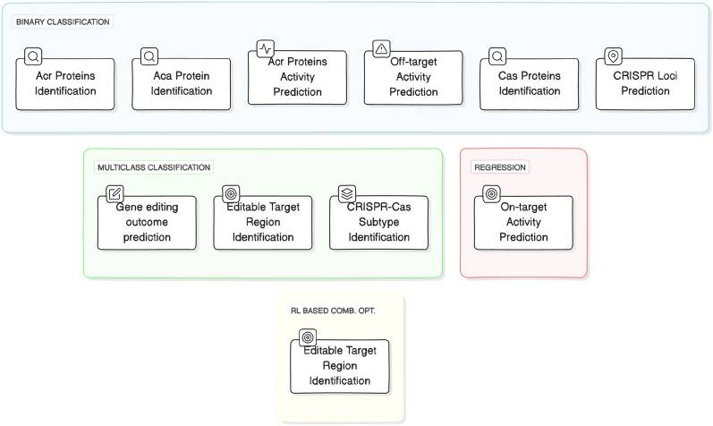
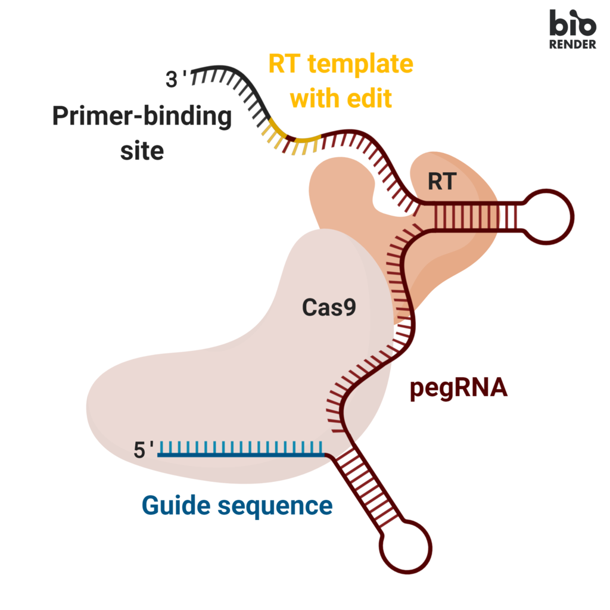
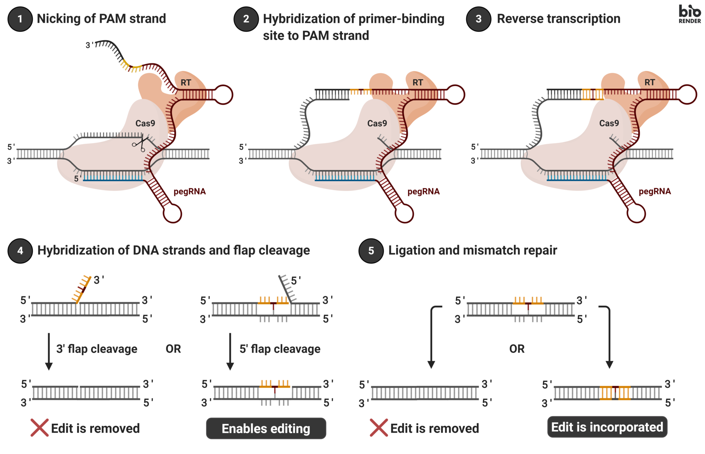

# AI for CRISPR

*Categorization of CRISPR related applications/tasks ([Abbasi et al., 2025](https://pmc.ncbi.nlm.nih.gov/articles/PMC11796103/)*)

Подробный обзор применения ИИ в CRISPR-связанных задачах приведен в статье [A. F. Abbasi et al. (2025) Transitioning from wet lab to artificial intelligence: a systematic review of AI predictors in CRISPR](https://pmc.ncbi.nlm.nih.gov/articles/PMC11796103/). В [Таблице 18](https://pmc.ncbi.nlm.nih.gov/articles/PMC11796103/table/Tab18/) представлены performance values of 39 different predictors across 76 different benchmark datasets related to 10 different CRISPR tasks

# LLM for CRISPR

## CRISPR-GPT

[K. Huang et al. (2024) CRISPR-GPT: An LLM Agent for Automated Design of Gene-Editing Experiments](https://arxiv.org/pdf/2404.18021)

The innovation of CRISPR-GPT Agent allows automated designs of gene-editing experiments
by simplifies the complex process into a series of manageable steps:
- Selection of CRISPR System: Tailoring the choice of CRISPR system to the experiment’s
needs.
- gRNA Design: Optimizing guide RNA sequences for efficiency and specificity based on the
Broad Institute’s gold-standard guideRNA library and CRISPRPick toolkit, including predesigned gRNA libraries [28, 14, 15, 43].
- Delivery Approach Selection: Advising on the most effective methods to introduce the CRISPR
components into target cells.
- Prediction of Off-target Effects: Assessing potential unintended alterations alongside desired
edits.
- Recommendation of Experimental Protocols: Outlining step-by-step procedures tailored to
the experiment’s objectives.
_ Validation Approach Recommendation and Primer Design: Recommending gest ways to validate the edits and help design the associated primers.

This approach, leveraging a chain-of-thought reasoning model and state machines, ensures that
even individuals new to gene editing can iteratively refine their experimental designs to achieve
protocols that meet their specific research needs. In addition, CRISPR-GPT offers:
- A Freestyle Q&A Mode for addressing ad hoc queries with precision,
- An Off-target Prediction Mode for in-depth analysis of pre-designed gRNAs.
These functions help the users when they meet additional issues during the experimental design
process.

*Evaluation results showing comparative performance of CRISPR-GPT and ChatGPT 3.5/4.0 in a range of gene-editing experiment design tasks across three different modes: MetaMode, AutoMode and QAMode. All tasks are scored in four different aspects: accuracy, reasoning, completeness, and conciseness. A score of 1 represents poor performance and 5 represents excellent performance.* *([Huang et al., 2024](https://arxiv.org/pdf/2404.18021))*

## ProGen2 and ESM-2

[J. Ruffolo et al. (2024) Design of highly functional genome editors by modeling the universe of CRISPR-Cas sequences](https://www.biorxiv.org/content/10.1101/2024.04.22.590591v1.full.pdf)

Краткий обзор статьи на русском: [Созданная нейросетью система CRISPR-Cas9 отредактировала геном человеческих клеток | N+1](https://nplus1.ru/news/2024/04/25/neurocrisprhttps://nplus1.ru/news/2024/04/25/neurocrispr)

While these novel systems have been sought for specific properties, such as small size or extended protein stability in biofluids (1, 2), they typically exhibit trade-offs in critical attributes such as basal activity in target cells, PAM selectivity, thermal optima, or in vitro biochemical properties, ultimately limiting their reach

В исследовании генерируются новые версии нуклеаз (белков, способных разрезать ДНК), предназначенные для работы в системе CRISPR-Cas. Эти нуклеазы, например, аналогичные Cas9, разработаны для улучшенной работы в системах редактирования генома, таких как CRISPR-Cas, но с повышенной точностью и сниженным риском off-target эффектов.

Авторы задействовали большую языковую модель (LLM) ProGen2, созданную ими ранее для нейросетевого дизайна белковых молекул. Целью исследования было создать новые белки с функциональностью, схожей с Cas9, но с более высокой специфичностью и эффективностью в условиях человека. Например, они разработали белок OpenCRISPR-1, который показал высокую активность при редактировании генома в человеческих клетках и имел меньшее количество off-target эффектов по сравнению с естественной нуклеазой SpCas9.

*Генерирование разных компонентов CRISPR-Cas*

Статья про ProGen-2: [E. Nijkamp et. al. (2023) ProGen2: Exploring the boundaries of protein language models](https://www.cell.com/action/showPdf?pii=S2405-4712%2823%2900272-7)

## CRISPR-BERT

[Y. Luo et al. (2024) Interpretable CRISPR/Cas9 off-target activities with mismatches and indels prediction using BERT](https://www.sciencedirect.com/science/article/pii/S0010482524000167)

1. ДНК-последовательности кодируются в виде токенов с использованием специального словаря (где каждый нуклеотид или комбинация с indel'ами имеет числовое представление).
2. *Эти последовательности обрабатываются BERT, который извлекает контекстные признаки (важные участки, паттерны мутаций).*
3. Выходные признаки из BERT комбинируются с CNN и BiGRU, чтобы учесть как локальные, так и длинные зависимости в последовательностях.
4. Добавляется балансировка классов, чтобы улучшить работу модели на неравномерных данных.

## Not only for CRISPR

О применение LLM для исследований в сфере микробиома и метагеномики можно прочитать в статье [B. Yan et al. (2025) Recent advances in deep learning and language models for studying the microbiome](https://www.frontiersin.org/journals/genetics/articles/10.3389/fgene.2024.1494474/full). Основные направления и примеры моделей:

| Задача | Используемые модели | Описание |
|----------|----------|----------|
| Предсказание структуры и функций белков	| ESM-2, ProtBERT, ProGen, ProtGPT2	| Используют трансформеры для предсказания структуры белков и их функций. |
| Генерация новых белков	| ProGen, ProtGPT2 |	Адаптированные GPT-модели, генерирующие искусственные белковые последовательности. |
| Предсказание взаимодействий вирусов и бактерий	| ViraLM (модификация DNABERT-2) |	Определение взаимодействий вирусов с хозяевами на основе геномных данных. |
| Выделение биосинтетических генетических кластеров (BGCs)	| BGC-Prophet, DeepBGC	| Выявление кластеров генов, ответственных за синтез вторичных метаболитов. |
| Контекстное представление генов в микробиомах	| gLM, FGBERT |	Определение значимости генов в геномном контексте. |
| Аннотирование вирусных последовательностей	| ViraLM, Flamholz et al. (2024) | Использование PLM для предсказания функций вирусных белков. |

Статья [S. Jiang, D. Yi (2024) Deep Learning-Based Self-Adaptive Evolution of Enzymes](https://www.thieme-connect.de/products/ejournals/pdf/10.1055/s-0044-1788317.pdf) рассматривает эволюцию ферментов с помощью глубокого обучения (DL). Это относится к биокатализу и биофармацевтике, где ферменты используются для разработки лекарств и химических соединений с высокой хиральной и региональной селективностью. Ферменты в дикой природе эволюционировали для работы с природными субстратами, но часто неэффективны для синтетических соединений, используемых в фармацевтике и промышленности. Для повышения их активности и стабильности требуется белковая инженерия.

| Задача | Используемые модели | Описание |
|--------|----------------------|----------|
| Предсказание структуры белков | AlphaFold2, ESMFold | DL-модели, предсказывающие 3D-структуры белков на основе последовательностей аминокислот. |
| Изучение связи последовательности и функции белков | MLP, RNN, CNN | Определяют, какие мутации улучшают катализ, стабильность и активность ферментов. |
| Генерация новых белков и мутаций | VAE, GAN, ProGen, ProT-VAE | Генерируют новые белковые последовательности с заданными свойствами, создавая виртуальные библиотеки мутантов. |
| Оптимизация каталитической активности ферментов | DLKcat, GNN, CNN | Предсказывают скорость ферментативных реакций (Kcat) и подбирают оптимальные мутации для повышения эффективности. |
| Выявление функциональных участков белков | GNN, 3D-CNN, SE(3) Transformer | Анализируют структурные данные для поиска активных центров и важных аминокислотных остатков. |
| Предсказание мутаций в металл-связывающих белках | MCCNN | Определяет потенциальные мутации, влияющие на активность металл-зависимых ферментов. |
| Улучшение стабильности белков | LM-GVP, BiLSTM, ECNet | DL-модели, использующие трансферное обучение, для предсказания влияния мутаций на устойчивость белков. |
| Автоматизированное проектирование ферментов | ProteinGAN, UniRep, ProtTrans | Создают белки с желаемыми свойствами, обучаясь на миллионах последовательностей. |

# The use of on-target mismatched gRNAs

## ExsgRNA

## Prime editing

Кратко о методе на русском: [Новый метод редактирования генома оказался точнее классического CRISPR/Cas9 | N+1](https://nplus1.ru/news/2019/10/21/prime-editing)

Метод праймированного редактирования генома (prime editing) — модификация системы CRISPR-Cas9, позволяющая вносить изменения без двухцепочечного разрыва. Метод использует каталитически ослабленную никазу Cas9, сшитую с обратной транскриптазой. (*[PCR News](https://pcr.news/novosti/dvoynoe-praymirovannoe-redaktirovanie-genoma-rabotaet-akkuratnee-crispr-cas9)*)

Dместо направляющей РНК, которую использует CRISPR/Cas для наведения на цель, в нее входит удлиненная гидовая РНК для праймированного редактирования (prime editing extended guide RNA, pegRNA, пргРНК). Эта РНК выполняет сразу две функции: определяет область, где пройдет редактирование, и несет в себе информацию, которую нужно «вписать» в ген.

*Components of prime editing* ([Wikipedia](https://en.wikipedia.org/wiki/Prime_editing))

Механизм работы новой системы выглядит следующим образом:

1. На нить ДНК садится измененный фермент Cas9, который расплетает дуплекс на две отдельные цепи.
2. ПргРНК «наводится» на участок ДНК, то есть прилипает к одной из нитей, защищая ее. На противоположной нити Cas9 вносит одноцепочечный разрез.
3. Другим своим концом пргРНК прилипает к разрезанной нити.
4. К белку Cas9 присоединен другой фермент — обратная траснкриптаза. Она строит ДНК на основе прг-РНК, тем самым «переписывая» ген заново.
5. В результате получаются две версии одного места ДНК: старая и новая. Одну из них разрушают внутриклеточные нуклеазы, и нередко это оказывается старая.
6. Новую версию белки репарации ДНК «вшивают» на место. При этом новая цепь ДНК и комплементарная ей вторая цепь не совпадают, и белки репарации должны одну из них расщепить, а другую — построить по образцу противоположной. Если добавить в систему еще одну гидовую РНК, которая наводит Cas9 на «неправильную» цепь, то Cas9 вносит в нее разрывы, и белки репарации принимают ее за ошибочную. В итоге получаются две копии нужной последовательности.

*Prime editing mechanism* ([Wikipedia](https://en.wikipedia.org/wiki/Prime_editing))

[J. Fei et. al. (2025) Mismatch prime editing gRNA increased efficiency and reduced indels](https://www.nature.com/articles/s41467-024-55578-z)

Some studies have reported that in certain circumstances, mismatches in the protospacer can also enhance the editing efficiency of Cas9 *[T. Zheng (2017) Profiling single-guide RNA specificity reveals a mismatch sensitive core sequence](https://www.nature.com/articles/srep40638)*

-----------------------------------------------------------------------

## Описание проекта

Этот проект представляет собой пайплайн для обработки данных. Основная цель пайплайна — загрузка, валидация, трансформация данных и их сохранение в базу данных SQLite. Процесс включает следующие шаги:

1. Скачивание исходного файла данных.
2. Преобразование текста в DataFrame.
3. Загрузка сырых данных в базу данных.
4. Валидация и добавление новых признаков.
5. Сохранение очищенных данных в отдельную таблицу БД.

Работа выполнялась как часть проекта "Созданием инструмента для оценки эффективности направляющих РНК в CRISPR-Cas системах" (более подробное описание проекта и его ценность можно посмотреть в презентации). В дальнейшем эти данные будут использованы для обучения алгоритмов МО и/или нейросетей для предсказания таргетной величины. 

## Создание новых признаков
В датасет добавлены пять новых признаков, три из них - это закодированные с помощью различных схем кодирования пары РНК-ДНК (длины N): 
1. *encoded_or* - матрица 4xN. Сначала ДНК и РНК one-hot кодируются по четырем каналам (ATGC), затем между ними выполняется операция ИЛИ. Подробнее в [статье](https://pmc.ncbi.nlm.nih.gov/articles/PMC6129261/)
2. *encoded_stacked* - матрица 8xN. Сначала ДНК и РНК one-hot кодируются по четырем каналам (ATGC), затем они "стекаются". Подробнее в [статье](https://academic.oup.com/bioinformatics/article/37/16/2299/6143578)
3. *encoded_7channels* - матрица 7xN. Позволяет работать с лишними или недостающими нуклеотидами в РНК (относительно таргетного участка ДНК), а также учитывает различные функциональные участки РНК (PAM или собственно направляющая РНК). Подробнее в [статье](https://www.sciencedirect.com/science/article/pii/S2001037022000137)
4. *gc_content* (гуанин-цитозиновый состав, ГЦ-состав) - доля гуанина (G) и цитозина (C) среди всех нуклеотидов последовательности. ГЦ-состав направляющей РНК влияет на ее эффективность, оптимальным считается значение 40-60% ([V. Konstantakos et al. 2022, CRISPR–Cas9 gRNA efficiency prediction: an overview of predictive tools and the role of deep learning ](https://academic.oup.com/nar/article/50/7/3616/6555429))
5. *pam* (protospacer adjacent motif; мотив, смежный с протоспейсером) - короткая последовательность ДНК (обычно длиной 2-6 пар оснований), она следует за таргетным участком ДНК и служит "сигналом" к разрезу. Данные в нашем датасете собраны для энзима Sp.Cas9, а ему соответствует PAM вида 5'-NGG-3', где N-любой нуклеотид. [Подробнее](https://www.addgene.org/guides/crispr/)

## EDA
Исследовательский анализ данных представлен в файле EDA.ipynb